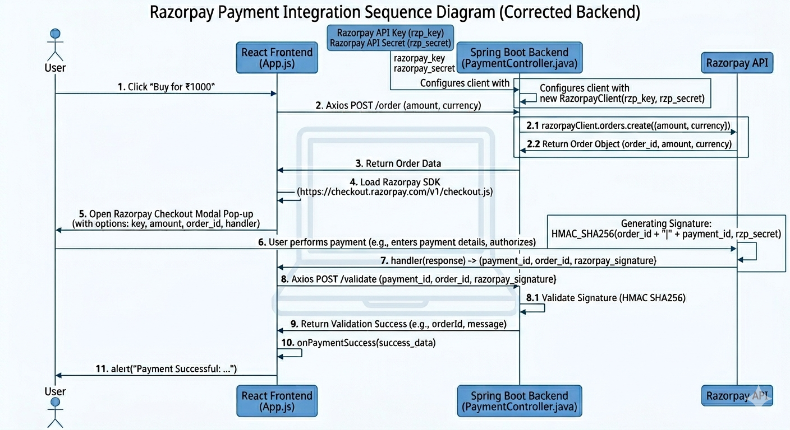

# Razorpay Payment Integration using ReactJS

This project demonstrates a complete Razorpay Payment Gateway Integration using ReactJS.

The application dynamically loads the Razorpay Checkout SDK, creates a payment order, opens the Razorpay payment popup, and securely handles the payment response.

The implementation follows a secure frontend-to-backend payment workflow used in modern production applications.

---

# Project Architecture

```text
React Frontend
      ↓
Load Razorpay Checkout Script
      ↓
Call Backend API
      ↓
Backend Creates Razorpay Order
      ↓
Return Order Details
      ↓
Open Razorpay Payment Popup
      ↓
User Completes Payment
      ↓
Receive Payment Response
      ↓
Backend Payment Verification
      ↓
Payment Success
```

---

# Payment Flow Overview

```text
Click Pay
   ↓
Load Razorpay SDK
   ↓
Call Backend API
   ↓
Create Razorpay Order
   ↓
Receive Order ID
   ↓
Open Razorpay Checkout
   ↓
User Completes Payment
   ↓
Receive Payment Response
   ↓
Verify Payment Signature
   ↓
Payment Success
```

---

## Payment Flow Sequence Diagram



---

# Step-by-Step Logic Explanation

---

# 1. User Clicks “Pay Now”

The payment process starts when the user clicks the payment button.

```html
<button onClick={paymentHandler}>
   Pay Now
</button>
```

This triggers the main payment function.

---

# 2. Dynamically Load Razorpay Checkout SDK

The project dynamically loads the Razorpay Checkout script from Razorpay CDN.

```javascript
const paymentHandler = async (e) => {
    e.preventDefault();

    // Load Razorpay checkout script
    const res = await loadScript(
      "https://checkout.razorpay.com/v1/checkout.js"
    );

    if (!res) {
      alert("Razorpay SDK failed to load. Are you online?");
      return;
    }
}
```

---

# Why Dynamically Load SDK?

Benefits:

- Reduces initial page load size
- Loads Razorpay only when payment starts
- Improves performance
- Avoids unnecessary script loading

---

# 3. Load Script Utility Function

The project uses a helper function to dynamically inject the Razorpay script into the webpage.

```javascript
const loadScript = (src) => {
  return new Promise((resolve) => {

    const script = document.createElement("script");

    script.src = src;

    script.onload = () => {
      resolve(true);
    };

    script.onerror = () => {
      resolve(false);
    };

    document.body.appendChild(script);

  });
};
```

---

# 4. Frontend Calls Backend API

After loading the SDK successfully, React calls the backend API to create a Razorpay order.

```javascript
const result = await axios.post("/payment/orders", {
   amount: 500
});
```

The backend creates the Razorpay order securely.

---

# Why Backend Order Creation?

Because:

- Razorpay Secret Key must remain secure
- Prevents amount tampering
- Ensures secure transaction processing

---

# 5. Backend Creates Razorpay Order

The backend creates an order using Razorpay SDK.

```javascript
const Razorpay = require("razorpay");

const razorpay = new Razorpay({
   key_id: process.env.RAZORPAY_KEY_ID,
   key_secret: process.env.RAZORPAY_KEY_SECRET
});

const options = {
   amount: 50000,
   currency: "INR",
   receipt: "receipt_order_1"
};

const order = await razorpay.orders.create(options);
```

---

# Important Note

Razorpay accepts amount in paise.

```text
₹500 = 50000 paise
```

Backend returns:

```json
{
   "id": "order_xyz"
}
```

---

# 6. Configure Razorpay Checkout

Frontend receives the order details and configures Razorpay Checkout.

```javascript
const options = {
   key: "rzp_test_xxxxx",
   amount: order.amount,
   currency: "INR",
   name: "Your Company",
   description: "Test Transaction",
   order_id: order.id,

   handler: function(response) {
      console.log(response);
   }
};
```

---

# 7. Open Razorpay Payment Popup

Once configured, the payment popup is opened.

```javascript
const paymentObject = new window.Razorpay(options);

paymentObject.open();
```

---

# 8. User Completes Payment

Razorpay securely processes payment using:

- UPI
- Credit Card
- Debit Card
- Wallet
- Net Banking

The application never directly handles sensitive card details.

---

# 9. Razorpay Returns Payment Response

After successful payment:

```javascript
handler: function(response) {
   console.log(response);
}
```

Response contains:

```json
{
   "razorpay_payment_id": "pay_xxxxx",
   "razorpay_order_id": "order_xxxxx",
   "razorpay_signature": "signature_xxxxx"
}
```

These values are essential for verification.

---

# 10. Payment Verification (MOST IMPORTANT STEP)

This is the core security layer.

Without verification:

- Fake payment success responses could be generated
- Payment status could be manipulated

---

# Signature Verification Logic

Backend generates signature using:

```text
HMAC SHA256
```

Logic:

```javascript
generated_signature =
   HMAC_SHA256(order_id + "|" + payment_id, secret)
```

Then compare with:

```javascript
razorpay_signature
```

If signatures match:

```text
Payment is genuine
```

Else:

```text
Payment tampered
```

---

# Core Security Principle

```text
Frontend cannot be trusted
Backend verification is mandatory
```

This prevents:

- Fake payments
- Amount modification
- Replay attacks
- Forged payment IDs

---

# Important Components in Project

---

# Frontend Components

## Dynamic SDK Loading

```javascript
loadScript()
```

## Payment Button

```html
<button>Pay</button>
```

## Axios API Call

```javascript
axios.post()
```

## Razorpay Checkout

```javascript
new window.Razorpay(options)
```

## Success Handler

```javascript
handler(response)
```

---

# Backend Components

## Razorpay SDK

```javascript
const Razorpay = require("razorpay");
```

## Razorpay Instance

```javascript
new Razorpay({
   key_id,
   key_secret
})
```

## Order Creation API

```text
/payment/orders
```

## Payment Verification API

```text
/payment/verify
```

---

# Why Order ID is Important

Using Razorpay Orders API provides:

- Better security
- Prevents amount tampering
- Links payment to transaction
- Enables refunds
- Supports signature verification

Without Order ID:

```text
Payments may auto-refund
```

---

# Environment Variables

```env
RAZORPAY_KEY_ID=
RAZORPAY_KEY_SECRET=
```

## Frontend Uses

```text
KEY_ID only
```

## Backend Uses

```text
KEY_SECRET privately
```

---

# Common Mistakes Avoided

## Never expose Secret Key in React

Unsafe practice.

---

## Never skip backend verification

Major security risk.

---

## Never trust frontend amount

Users can modify it.

---

# Possible Production Enhancements

---

# Database Storage

Store:

- order_id
- payment_id
- customer info
- payment status

---

# Razorpay Webhooks

Automatically receive events like:

```text
payment.captured
payment.failed
refund.processed
```

---

# Payment Retry

Allow retry for failed transactions.

---

# Invoice Generation

Generate PDF invoice automatically.

---

# Email Notifications

Send payment receipt to customer.

---

# Production-Level Architecture

```text
React App
   ↓
Load Razorpay SDK
   ↓
API Gateway
   ↓
Payment Service
   ↓
Razorpay
   ↓
Webhook Verification
   ↓
Database Update
   ↓
Notification Service
```

---

# Technologies Used

| Layer | Technology |
|---|---|
| Frontend | ReactJS |
| API Calls | Axios |
| Payment Gateway | Razorpay |
| Backend | Node.js / Express |
| Security | HMAC SHA256 |
| SDK Loading | Dynamic Script Injection |
| Checkout UI | Razorpay Checkout |

---

# Why Razorpay is Easy to Integrate

The biggest advantage:

```text
Razorpay handles PCI compliance
```

So the application does NOT store:

- Card numbers
- CVV
- Banking credentials

This greatly reduces security complexity.

---

# Official References

- Razorpay Node.js Integration Docs  
  https://razorpay.com/docs/payments/server-integration/nodejs/integration-steps/

- Razorpay Checkout Documentation  
  https://razorpay.com/docs/payments/payment-gateway/web-integration/

- Razorpay Official Website  
  https://razorpay.com/

---

# Summary

This project demonstrates a secure and scalable Razorpay payment integration using:

- ReactJS
- Dynamic Razorpay SDK Loading
- Backend Order Creation
- Razorpay Checkout Popup
- Signature Verification
- Secure Payment Processing

It follows the same architecture used in modern production payment systems.

---
